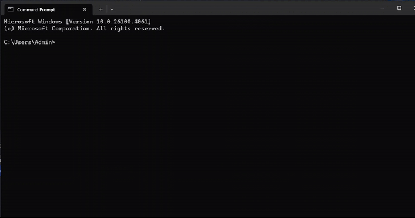
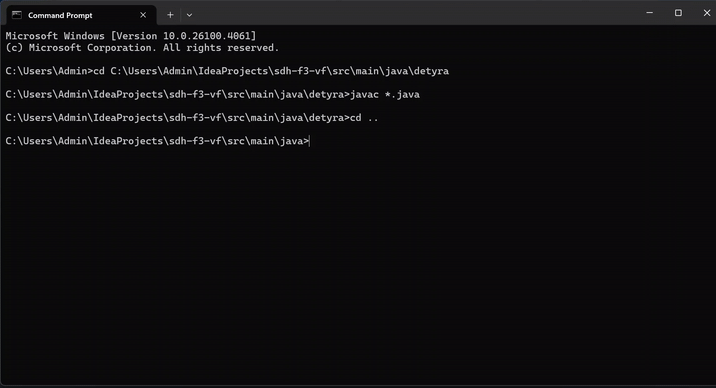
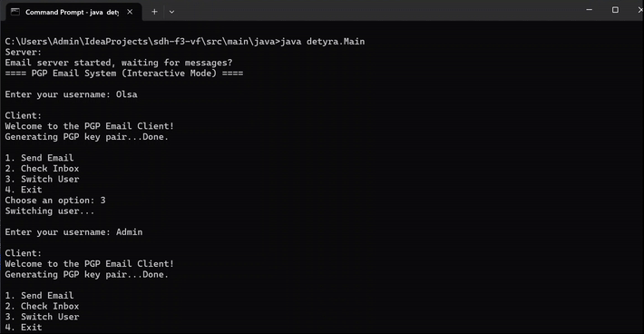

# 📧 PGP (Pretty Good Privacy) Simulation for Email Encryption Console Application

A simple command-line email system implemented in Java, simulating secure email communication using **PGP (Pretty Good Privacy)** concepts like **public/private key encryption** and **digital signatures**.  
This project supports both **interactive mode** and **command-line parameter mode**.

---

## 📁 Project Structure

```bash
detyra/
├── Main.java              # Entry point
├── EmailServer.java       # Central server that stores and distributes emails
├── EmailClient.java       # Represents a user with PGP keys
├── Email.java             # Data structure for an email
├── KeyGenerator.java      # Generates a secure RSA key pair (2048 bits).
├── KeyStore.java          # Persistent storage of public and private keys for all users.
├── PGPUtils.java          # Implements cryptographic functions to simulate PGP behavior.
```

---

## 🛠️ Installation & Setup

### Prerequisites

- Java 11 or higher installed
- Terminal or command prompt access
- (Optional) IDE like IntelliJ IDEA or VSCode for easier development

### 1. Clone the repository

```bash
git clone https://github.com/olsadomi/SDH-Gr10-PGP.git
cd [path to your directorium]
```
### 2. Compile the program
```bash
javac detyra/*.java
```

### 3. Run in interactive mode
```bash
java detyra.Main
```
### 4. Run in command-line mode
```bash
java detyra.Main <username> send <recipient> <message>
java detyra.Main <username> inbox
```

🔁 Example:
```bash
java detyra.Main bob send alice "Hello Alice, this is a test!"
java detyra.Main arta inbox
```
----------------------------------------------------------------------

## 🎮 Features
- User-based login (username only)
- Inbox for each user
- Send and receive encrypted and signed messages
- Interactive mode and direct command-line mode
- PGP-like simulation using asymmetric encryption


## 🔐 How PGP is Simulated
This section explains how the security mechanisms work behind the scenes.

- #### Key Generation:
When a new user is created (i.e., used for the first time), a key pair is generated using Java’s KeyPairGenerator (RSA 2048 bits).

- #### Encryption:
The message is encrypted with the recipient’s public key, ensuring only they can decrypt it.

- #### Digital Signature:
The sender signs the message using their private key. When the recipient receives it, they use the sender’s public key to verify the message’s integrity and authenticity.

- #### Decryption:
The recipient uses their private key to decrypt the message.

---------------------------------------------------------------------------

## 🎥 Demonstration Videos
- #### Compiling in Command Prompt
- 

- #### Console Program with Parameters
- 

- #### Additional Transparent Mode
- 


## 💡 Additional Notes
- This is a simulated environment: no real networking or persistent file storage.
- Ideal for demonstrating how cryptographic principles work in secure communication.
-------------------------------------------------------------------------
## 👩‍💻 Authors
- Mehmet Mehmeti
- Muhamed Jakupi
- Natyra Bajgora
- Olsa Domi

##### Data Security Project - PGP (Pretty Good Privacy) Simulation for Email Encryption Console Application
##### Students of Computer & Software Engineering - University of Prishtina